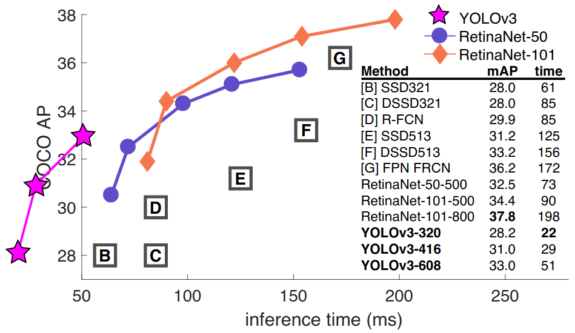
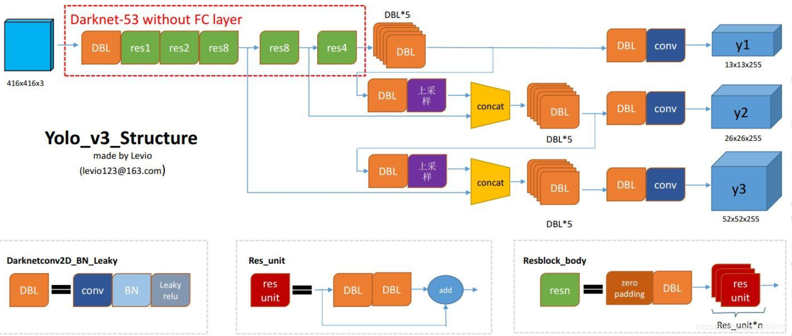
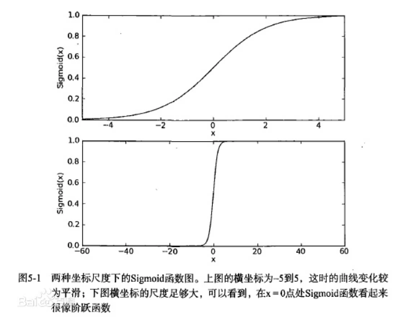
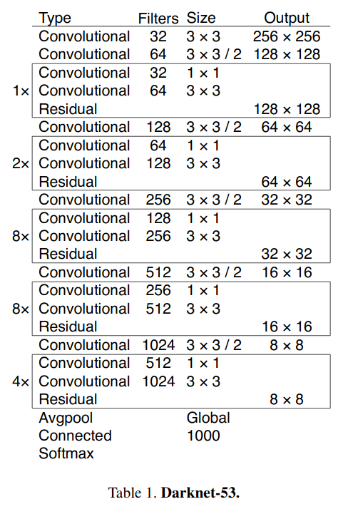

# 介绍
YOLOv3是YOLO家族的第三代网络。论文链接：[YOLOv3: An Incremental Improvement](https://arxiv.org/abs/1804.02767)，本地链接：[YOLOv3: An Incremental Improvement](yolov3/YOLOv3: An Incremental Improvement)

如图，YOLOv3相对于SSD，RFCN，RetinaNeet等网络性能表现都很优异。

# 网络架构

从[yolo系列之yolo v3【深度解析】](https://blog.csdn.net/leviopku/article/details/82660381)搬运一张yolov3结构图。

yolov3网络所有的激活函数用的都是Sigmoid。
$$
Sigmoid(x)=\frac{1}{1+e^{-x}}
$$

总体来说，可以分为三部分，Backbone，neck和Heads。Backbone部分采用新提出的DarkNet53进行特征提取，该网络采用连续的`3x3`和`1x1`卷积层以及一些shortcut层，总共有53个卷积层。在网络中，`shortcut`层实际上是对某两个层进行`add`操作，而`route`层则是对某两层进行`concat`操作。

# 架构分析

to be filled

# 作者

朱文康

如果你有任何问题，请发送至我的邮箱 [1119741654@qq.com](1119741654@qq.com)。我很高兴回复。

谢谢。

# 参考文献

- https://arxiv.org/abs/1804.02767

/?hl=zh_CN&webmailhost=mail.innosilicon.com.cn&ch=&msg=ERR.LOGIN.PASSERR&from=bj