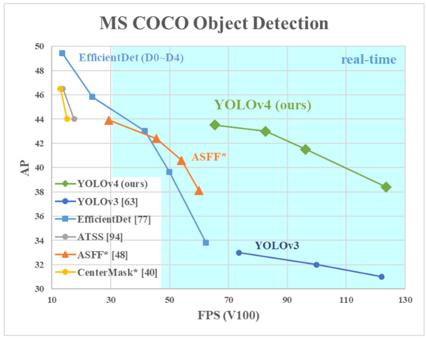
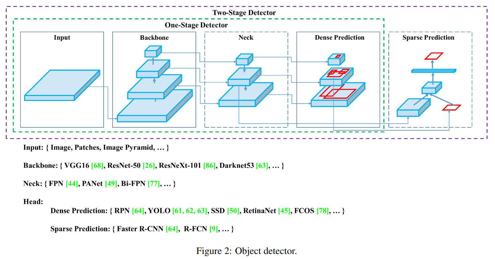
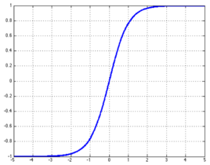
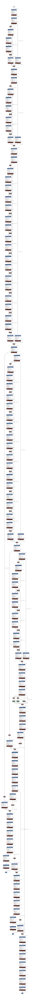

# 介绍
YOLOv4是YOLO家族的第四代网络。论文链接：https://arxiv.org/pdf/2004.10934v1.pdf，本地链接：[YOLOv4: Optimal Speed and Accuracy of Object Detection.pdf](yolov4/YOLOv4: Optimal Speed and Accuracy of Object Detection.pdf)

如图，在COCO数据集上，YOLOv4相对于其他现流行的网络，帧率和精度都表现的很优异。

# 网络架构

利用开源工具[https://github.com/lutzroeder/Netron](https://github.com/lutzroeder/Netron)可以导入`.cfg`文件来绘制网络图，网页版app：[https://netron.app/](https://netron.app/)。

在分析YOLOv4模型前，有必要对Mish函数进行介绍，因为网络所有的激活函数用的都是Mish。
$$
Mish(x)=xtanh(ln(1+e^x))\\
tanh(x)=\frac{e^x-e^{-x}}{e^x+e^{-x}}
$$

总体来说，可以分为三部分，Backbone，neck和Heads。Backbone部分采用CSPDarkNet53，共有5个block，一共107层；neck部分采用了SPP和PANet，构成了模型的108层～131层；Heads部分采用了卷积层+YOLO层，生成结果锚框，构成了模型最后的132～161层。

# 架构分析

[逐层参数统计表](yolov4/YOLOv4.xlsx)

# 作者

朱文康

如果你有任何问题，请发送至我的邮箱 [1119741654@qq.com](1119741654@qq.com)。我很高兴回复。

谢谢。

# 参考文献

- https://arxiv.org/pdf/2004.10934v1.pdf
- https://gitee.com/zhangtao7750/yolov4-tf2
- https://github.com/lutzroeder/Netron
- https://zhuanlan.zhihu.com/p/137393450