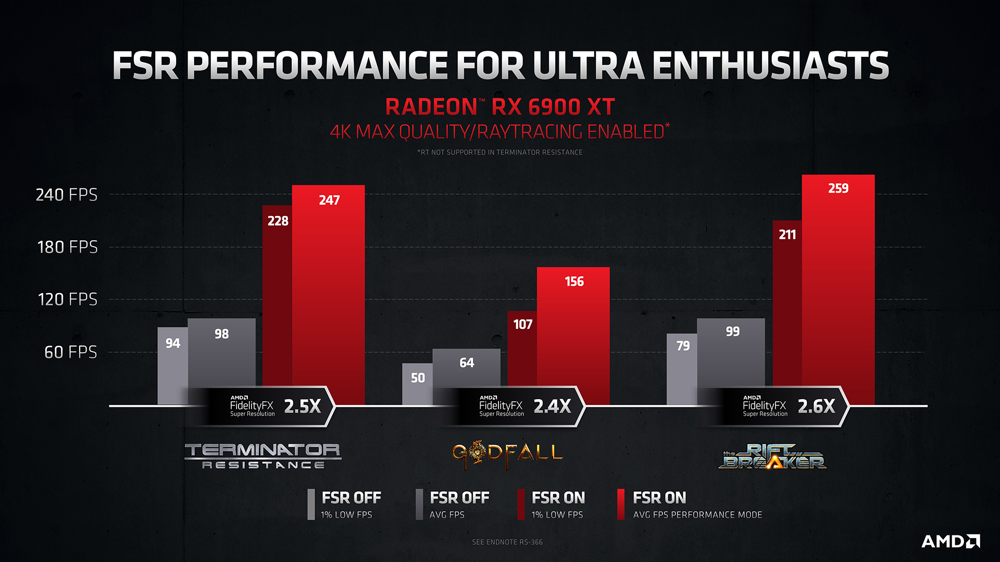
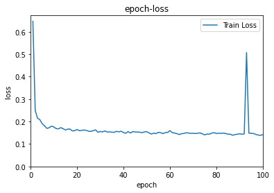

# FSR

2021年6月1日，AMD发布了FSR技术，对标NVIDIA的NLSS技术，可以对游戏画面进行实时超分辨，降低原生渲染高分辨率的性能要求、提高游戏帧率。

本文复现了AMD之前申请过的一个超分辨率专利。

# 介绍

1. 什么是 AMD FidelityFX 超级分辨率？

   FSR 是我们全新的、开源的、高质量的解决方案，用于**从较低分辨率的输入生成高分辨率帧**。它使用了一系列尖端算法，特别强调创建高质量的边缘，与直接以原始分辨率渲染相比，性能有了很大的提升。 FSR 为昂贵的渲染操作（例如硬件光线追踪）提供“实用性能”。

2. 它是如何工作的？

   FidelityFX Super Resolution 是一种空间放大技术，可从每个输入帧生成“超分辨率”图像。换句话说，**它不依赖于历史缓冲区或运动向量**。它也**不需要任何每场比赛的训练**。

3. 不同模式的输入输出：
| **FSR QUALITY MODE** | **SCALE FACTOR**   | **INPUT RESOLUTION FOR 1440P FSR** | **INPUT RESOLUTION FOR 4K FSR** |
| -------------------- | ------------------ | ---------------------------------- | ------------------------------- |
| **“Ultra Quality”**  | 1.3X per dimension | 1970 x 1108                        | 2954 x 1662                     |
| **“Quality”**        | 1.5X per dimension | 1706 x 960                         | 2560 x 1440                     |
| **“Balanced”**       | 1.7X per dimension | 1506 x 847                         | 2259 x 1270                     |
| **“Performance”**    | 2.0X per dimension | 1280 x 720                         | 1920 x 1080                     |

4. 在AMD最新的 RX 6900 XT 显卡上，4K 超分最高帧率为 259 FPS。

   [RX 6900 XT](https://www.amd.com/zh-hans/products/graphics/amd-radeon-rx-6900-xt) 显卡的峰值单精度计算性能为：23.04 TFLOPs，**每帧所需算力（渲染+超分）不高于 88.96 GFLOPS**。

# 网络分析

## 网络结构

广泛流传的说法是，FSR是按照AMD发布的[论文](https://arxiv.org/abs/1609.05158)和[专利](https://patentimages.storage.googleapis.com/2a/f5/f1/2d49ec391624ed/US20210150669A1.pdf)来实现的。下面两个是专利中的网络结构图，Fig. 3是一个简要的结构图，Fig .4是一个详细的流程图。

专利中描述的超分网络将原始的单帧LR图像进行线性特征提取（卷积，低频特征）和非线性特征提取（卷积，tanh，高频特征），然后将两组特征相加（或者拼接？），最后进行Pixel Shuffle将特征图放大到需要的高分辨率帧。

首先对原图使用除法和减法使其**标准化到[-1,1]的区间**，然后分两支进行卷积得到**线性和非线性特征提取**，将两支路的特征图相加，最后进行像素重组等操作得到高分辨率帧。

## 量化分析

- 1440p -> 2168p （Quality，1.5x）

1. 按照专利上的卷积核数量，按照 4K-Quality 超分（1440p -> 2160p），每帧需要的算力为 171.64 GFLOPS**（大于 88.96G，不成立）**，每T单精度浮点算力可以超分 5.8 帧。

2. 按照32个卷积核数量，按照 4K-Quality 超分（1440p -> 2160p），每帧需要的算力为 80.45 GFLOPS**（接近 88.96G，不成立）**，每T单精度浮点算力可以超分 12.43 帧。

3. 按照16个卷积核数量，按照 4K-Quality 超分（1440p -> 2160p），每帧需要的算力为 23.24 GFLOPS**（小于 88.96G，但考虑到效率一般为30%～40%，可用算力为 30 GFLOPS 左右，可能成立）**，每T单精度浮点算力可以超分 43.03 帧。

4. 按照最小卷积核数量（3 * 1.5 * 1.5 = 6.75），按照 4K-Quality 超分（1440p -> 2160p），每帧需要的算力为 7.37 GFLOPS**（远小于 88.96G，可能成立）**，每T单精度浮点算力可以超分 135.6 帧。

- 720p -> 1440p （Performance，2x）

1. 按照专利上的卷积核数量，按照最低规格超分（720p -> 1440p），每帧需要的算力为 42.91 GFLOPS，每T单精度浮点算力可以超分 23.3 帧。

2. 按照最小卷积核数量（3 * 2 * 2 = 12），按照最低规格超分（720p -> 1440p），每帧需要的算力为 3.56 GFLOPS，每T单精度浮点算力可以超分 280.8 帧。

# 结果

训练过程收敛性

# 参考文献

