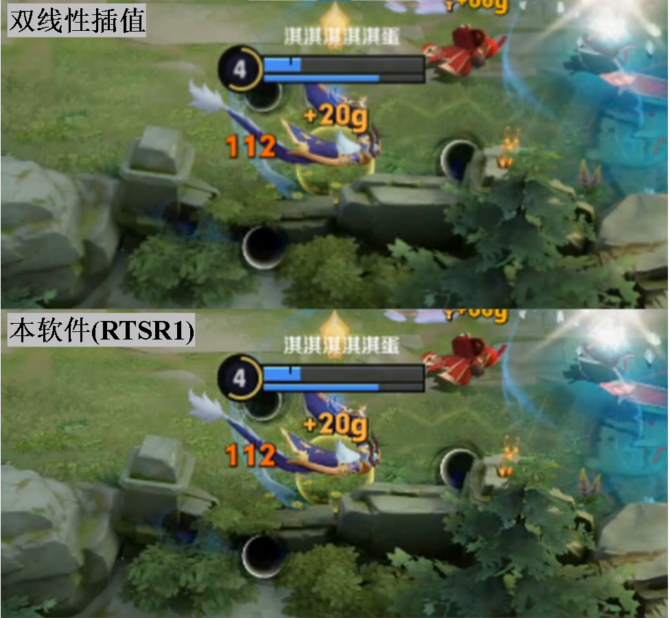

# 介绍
本仓库将对一些论文中提出的`SR算法`进行总结和复现，使用的推理框架是`TensorFlow`。

Github文档地址：[https://lankning.github.io/Super-Resolution/](https://lankning.github.io/Super-Resolution/)

Dataset: https://wwbm.lanzouy.com/ii1po0l8a28f


# 模型

## 经典模型

- [x] SRCNN 2014
- [x] FSRCNN 2016
- [x] ESPCN 2016
- [x] VESPCN 2017 （Only Notes）
- [x] DUF 2018
- [x] FALSR 2019（Only Notes）
- [x] TGA 2020（Only Notes）
- [x] One-Stage STVSR（Partly codes）
- [x] AMD SR  2021 （Only Notes）

## 自建模型

- [x] RTSR1
- [x] RTSR2
- [x] RTSR3


# 环境

tensorFlow-gpu>=2.2, <=2.5

```
jupyter notebook
opencv-python
pillow
matplotlib
```


# 使用步骤

1. 如果你有conda，建议使用conda创建一个新的环境，并安装`TensorFlow`等必要的库

```bash
conda create -n tf22 python=3.7
conda activate tf22
conda install tensorflow-gpu=2.2
pip install -r requirements.txt -i https://pypi.mirrors.ustc.edu.cn/simple/
```

2. 使用`jupyter`运行`data_prepare.ipynb`文件，在本文件夹打开终端，输入

```bash
jupyter notebook
```

3. 以`SRCNN`为例，运行`SRCNN.ipynb`文件是重新训练模型，运行`LR2HR.ipynb`文件是将低清视频通过模型转为高清。仍然在`jupyter`中打开，运行。


# 超分效果

## 2X超分

- RTSR1



- RTSR2


- RTSR3


# 文件组织

## 目录树
- data
	- train_data
	- train_data?x 
	- demo.mp4 (you can require this demo video by https://wwe.lanzous.com/iXi1dow5r3g)
- Re-Implementated Model
	- model
		- model.h5
	- static
		- paper.pdf
		- images.png
	- SRCNN.ipynb: train SRCNN model
	- LR2HR.ipynb: transfer LR frames to HR video using trained model
	- utils.ipynb: ipynb version of utils
	- utils.py: python module for use
	- README.md
- data_prepare.ipynb: prepare data from video
- utils.py: python module for use
- README.md
- requirements.txt
## 数据准备
- get frame from video
- transfer HR images to LR images
## 数据文件夹
- Low-resolution: 
eg. **./data/train_data4x/:** The scaled frames by 4x which will be used in train stage 
eg. **./data/train_data2x/:** The scaled frames by 2x which will be used in train stage 
- Original-resolution: 
**./data/train_data/:** The HR frames which will be used in train stage coresponde to **./data/x_train_data?x/** 


# 作者

1. 猪老大；邮箱：[lankning@163.com](mailto:lankning@163.com)
2. 贺老大；邮箱：[2733096939@qq.com](mailto:2733096939@qq.com)

如果你有问题，欢迎联系我们，乐意回复。

谢谢！


# 参考文献

- 论文
- [https://tensorflow.google.cn/](https://tensorflow.google.cn/)
- [学习笔记之——基于深度学习的图像超分辨率重建](https://blog.csdn.net/gwplovekimi/article/details/83041627?utm_medium=distribute.pc_relevant_download.none-task-blog-baidujs-8.nonecase&depth_1-utm_source=distribute.pc_relevant_download.none-task-blog-baidujs-8.nonecase#ESPCN%EF%BC%88Efficient%20Sub-Pixel%20Convolutional%20Neural%20Network%EF%BC%89)
- [视频超分(VSR)](https://blog.csdn.net/srhyme/category_10487261.html)