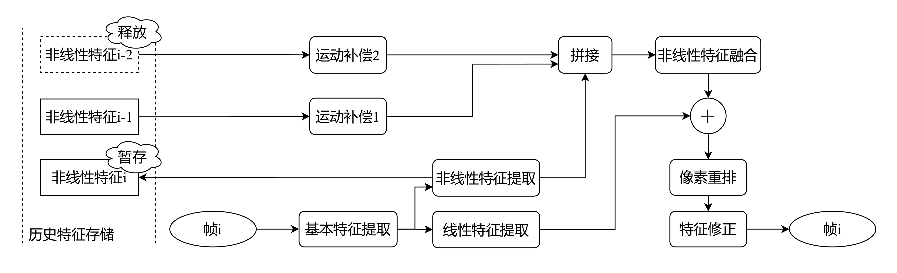
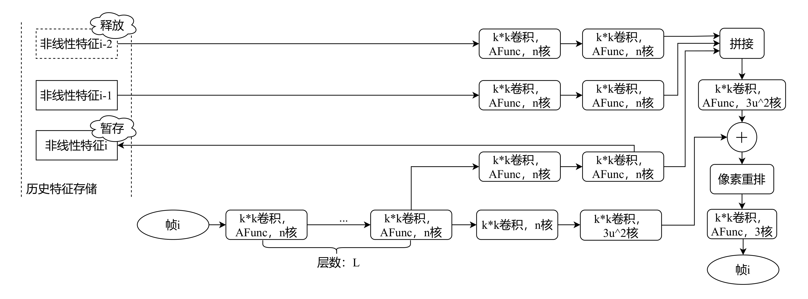
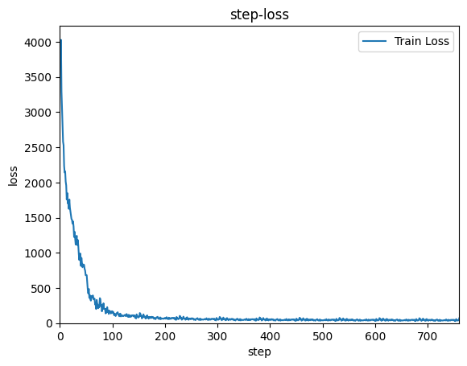
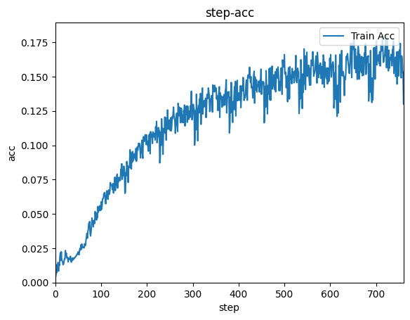
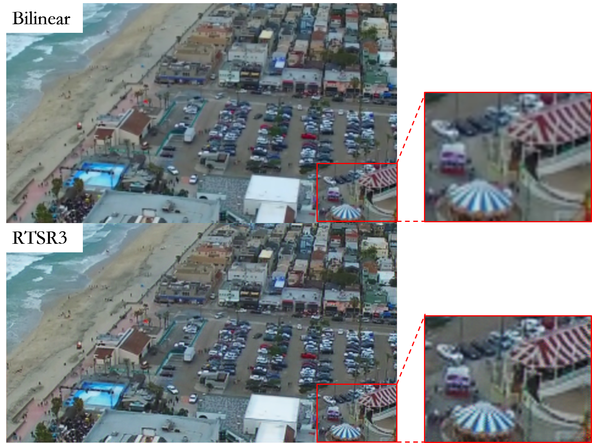

# 介绍

这是学习经典超分辨率神经网络之后自己写的第3个版本超分辨率网络RTSR3

The code are written by Paddle 2.3 with Python 3.8 under Ubuntu 18.04. The required packages are frozen into `requirements.txt`, a conda environment can be built to get the same developing environment.

# 结构

整体结构如下



详细结构如下



# Usage

1. Train
```bash
python3 train.py
```

2. Test

```bash
python3 test.py
```

3. Transfer to ONNX

   Reference: https://github.com/PaddlePaddle/Paddle2ONNX/issues/260

   Cannot convert to onnx format now.

   Issue has been proposed. https://github.com/PaddlePaddle/Paddle2ONNX/issues/894


# 结果

训练收敛过程





最后结果


